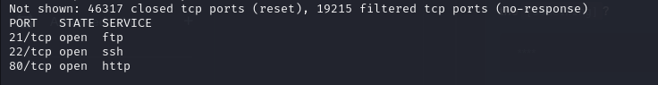
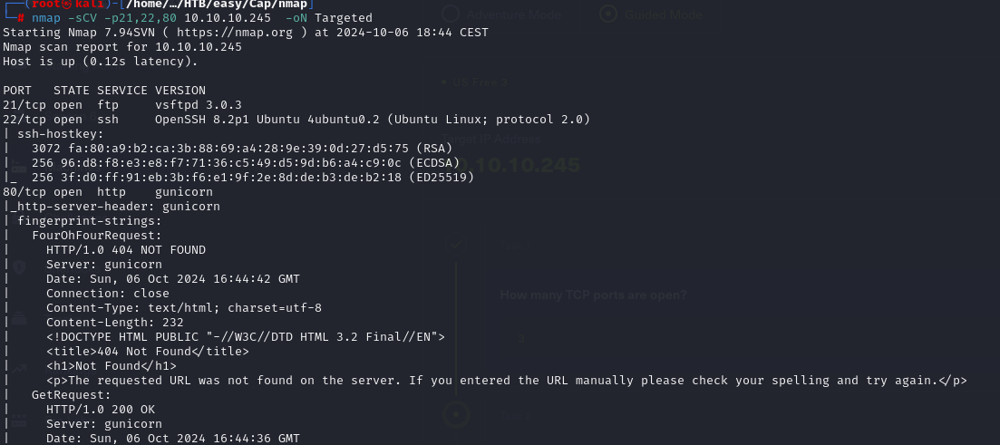
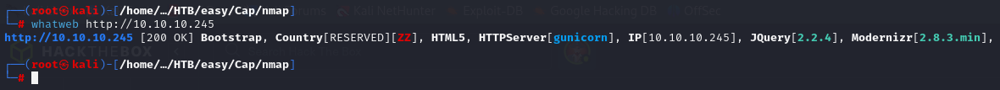
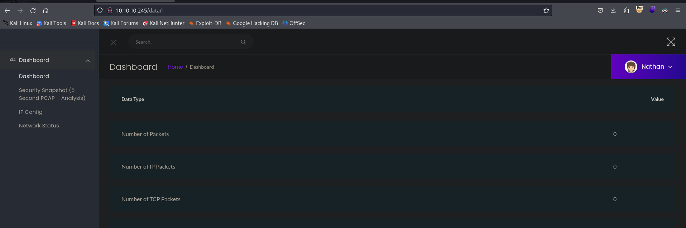
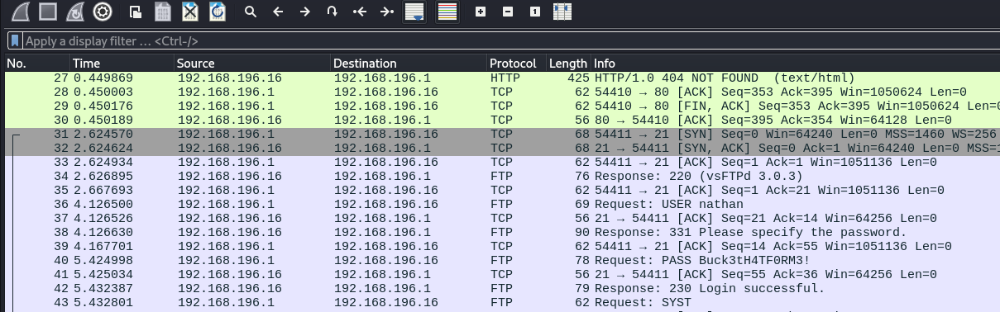
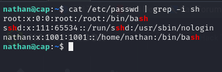
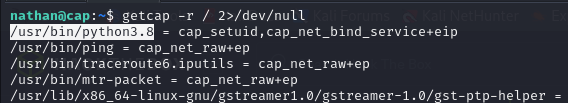
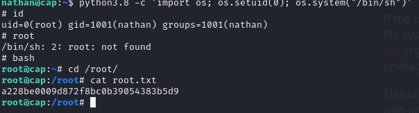

# Enumeración

Empezamos con el reconocimiento básico de la máquina con un escaneo de puertos para ver qué encontramos.

En este caso, vemos que tenemos tres puertos abiertos:  
- **21**: FTP  
- **22**: SSH  
- **80**: HTTP  

Con esto, realizamos un escaneo más exhaustivo para ver las versiones que corren.

Ahora podemos ver qué versión corre en el FTP, en el SSH, y qué tipo de servidor corre el servicio HTTP. En este caso, se trata de **gunicorn**.  

Como no tenemos credenciales de usuario para probar en el FTP ni en el SSH, vamos a tirar del servicio web a ver qué podemos sacar.

---

## Servicio Web

De primeras, lanzamos un `whatweb` para ver qué está corriendo.

Podemos ver que el servidor es **gunicorn** y que tenemos un panel con varias capturas de red descargables para examinar.

La página principal se ve así:

Aquí encontramos un posible usuario para probar en FTP y SSH: Nathan

Lo dejamos para más adelante, porque parece que esta parte tiene más chicha.

---

### IDOR

Viendo cómo se tratan las URLs, parece que al cambiar el número en el parámetro tenemos un posible **IDOR**, lo que nos permitiría acceder a capturas que no pertenecen a este usuario.  

Vamos a realizar un ataque tipo *Intruder* con **Burp Suite** para ver si conseguimos resultados.

Tras las pruebas, los únicos IDs válidos son del `0` al `10`. Los demás provocan un redireccionamiento. Con *Intruder* vemos que el ID `0` es interesante:  

Tenemos una captura de tráfico FTP con un inicio de sesión y contraseña.

Credenciales encontradas:

`nathan:Buck3tH4TF0RM3!`

Con esto podemos probar el acceso a FTP y SSH.  

- **FTP**: nos conectamos al `/home` del usuario `nathan`.  
- **SSH**: también funciona con las mismas credenciales.

---

## Escalada de privilegios

Vemos que `nathan` no tiene privilegios más allá de los suyos personales; no hay más usuarios aparte de `root` y él mismo.

---

### Capabilities en Python

Este usuario no tiene ningún archivo interesante ni hay binarios con permisos SUID que podamos usar para escalar privilegios. Sin embargo, revisando las *capabilities* encontramos algo muy interesante:

Un binario de Python versión 3.8 tiene la *capability* `cap_setuid`, la cual, según [GTFOBins](https://gtfobins.github.io/gtfobins/python/), nos permite escalar privilegios a usuario **root**.

---

